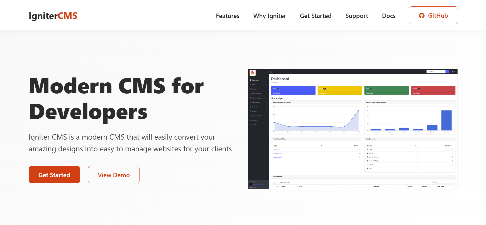

# 🌐 Igniter CMS Website

The **Igniter CMS Website** is a modern, responsive single-page site built to showcase the features, benefits, and community around [Igniter CMS](https://www.ignitercms.com) — a lightweight and powerful open-source content management system based on the CodeIgniter 4 framework.

---

## 🎯 Purpose

This website serves as the official landing page for Igniter CMS. It provides:

- An overview of what Igniter CMS is and who it’s for
- A showcase of key features and benefits
- Links to documentation, the GitHub repository, live demo, and support options
- A clean and professional web presence to build trust with potential users

---

## 🚀 Live Site

🔗 [www.ignitercms.com](https://www.ignitercms.com)

This site is deployed and kept up-to-date with the latest information and links to all relevant Igniter CMS resources.
